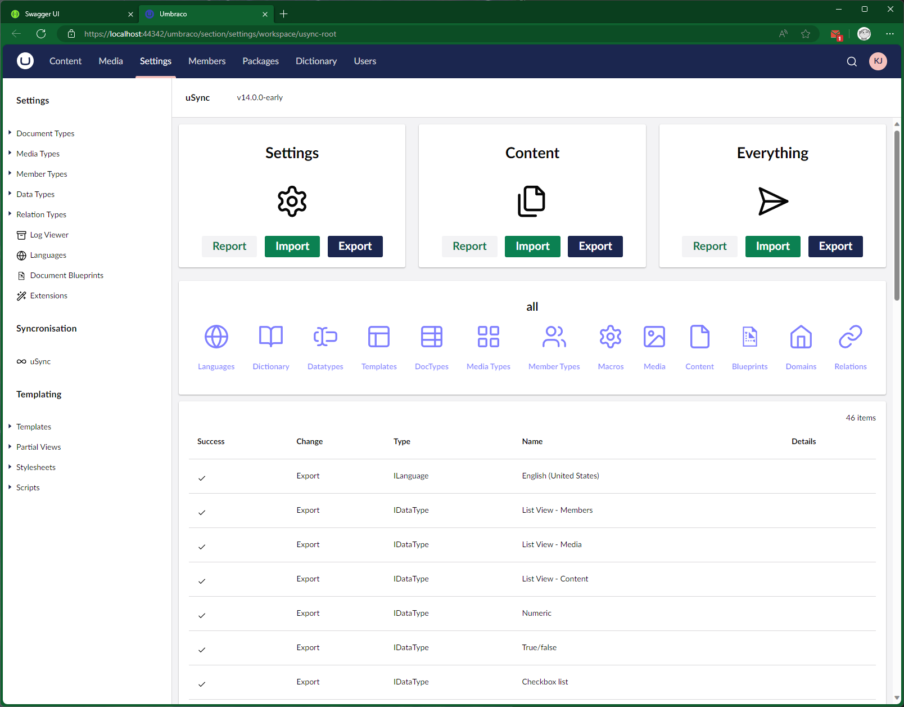

# uSync - for UniCore
###  (Umbraco on NetCore aka Umbraco 9 and beyond)
Database syncing tool for Umbraco  

## What is uSync 

uSync is a Umbraco package that reads and writes your Umbraco settings to and from disk. This allows you to source control and deploy changes you make inside Umbraco.

https://jumoo.co.uk/uSync/

## License
